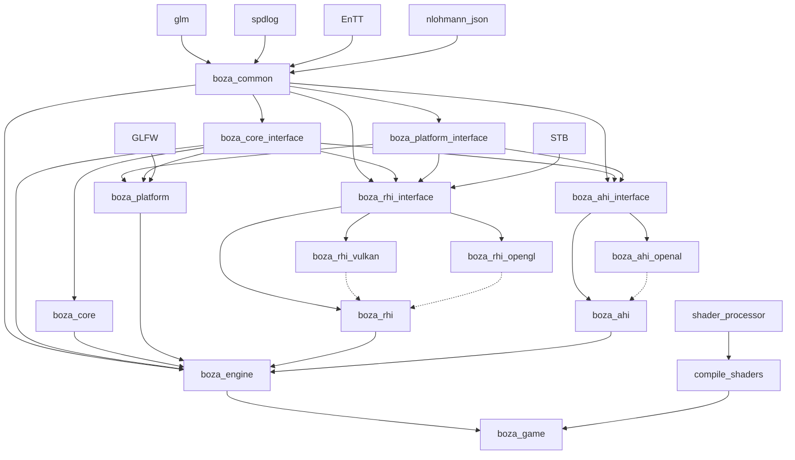
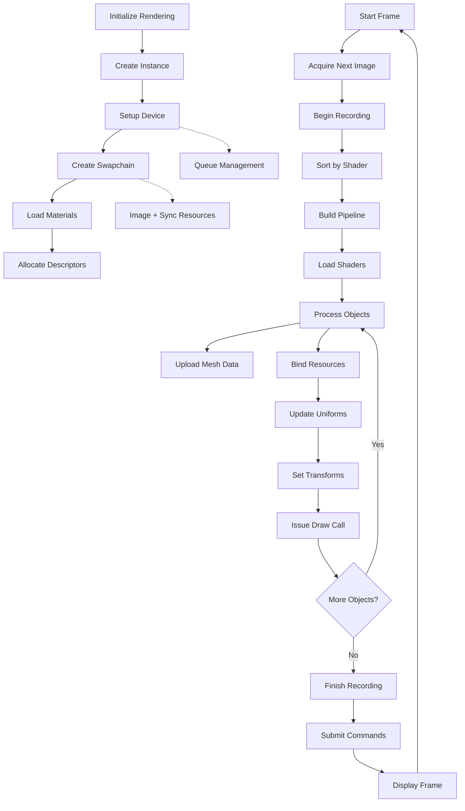

# Project Structure & Modules

This file explains how the project is constructed and how the engine modules relate to each other.

Top-level modules
- `common/` — pch, asset path resolver
- `core/` — the core engine facilities (GameLoop, Scene, GameObject, Components, Logger, etc.).
- `platform/` — window creation
- `rhi/` — Rendering Hardware Interface: abstraction layer for graphics APIs (only Vulkan is currently implemented).
- `ahi/` — Audio Hardware Interface: abstraction for audio backends (currently just the skeleton).
- `src/` — engine dll entry points and higher-level subsystems.
- `shaders/` and `tools/shader_processor` — shader sources and the processing tool used by the build to produce SPIR-V and other variants.
- `game/` — sample game using the engine and demonstrating scene setup, example behaviors, materials, etc.

How modules interact

Rendering Flow

Notes
- The `rhi` provides an API for creating buffers, textures, pipelines, descriptor sets, command buffers, and submitting work. The intention is to let the `src`/`core` subsystems remain backend-agnostic.
- A similar approach will be taken for the `ahi` subsystems.
- Shader processing is integrated into the CMake flow so shaders are precompiled into SPIR-V and platform variations during the build.
